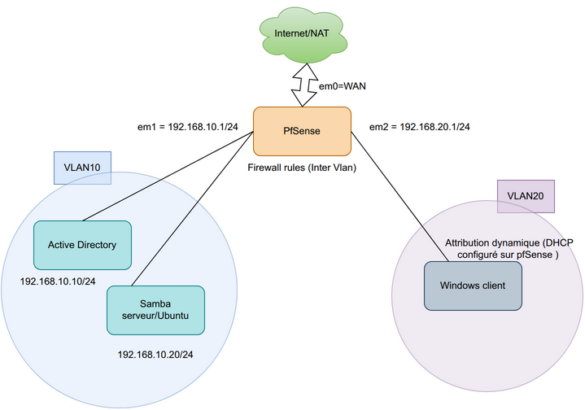

# LAB1 : Environnement Virtualisé Isolé (Active Directory & pfSense)

## 📌 Présentation du projet
Ce projet a été réalisé dans le cadre d'un apprentissage pratique pour concevoir, déployer et administrer un réseau d'entreprise virtualisé et cloisonné[cite: 1]. L'objectif principal est de maîtriser l'architecture d'un domaine Active Directory (AD), la gestion d'un contrôleur de domaine, le routage/filtrage réseau via pfSense et la mise en place d'un serveur de fichiers sécurisé (Samba/Ubuntu)[cite: 1].

---

## 🎯 Objectifs pédagogiques
* **Gestion Réseau & Pare-feu :** Configuration d'un routeur/pare-feu pfSense multi-interfaces pour le routage inter-VLAN et le cloisonnement du trafic.
* **Services d'Annuaire :** Installation et configuration d'un Contrôleur de Domaine (DC) sous Windows Server avec Active Directory (DNS, GPO).
* **Partage et Sécurité :** Mise en place d'un Serveur de Fichiers sous Ubuntu/Samba intégré au domaine.
* **Isolation :** Création d'un environnement virtualisé étanche (sans risque pour un réseau de production)[cite: 1].

---

## 🏗️ Architecture du Réseau
L'environnement a été entièrement virtualisé sous **VMware**, en utilisant trois interfaces réseau distinctes sur le pare-feu pfSense pour simuler une segmentation rigoureuse :

### Détail des interfaces et segments :
* **`em0` (WAN) :** Connectée en mode NAT/Bridge pour l'accès aux mises à jour et simuler la passerelle vers l'extérieur.
* **`em1` (VLAN 10 - Réseau Serveurs) :** `192.168.10.0/24` — Héberge le Contrôleur de Domaine Active Directory (`192.168.10.10`) et le serveur de fichiers Samba (`192.168.10.20`).
* **`em2` (VLAN 20 - Réseau Clients) :** `192.168.20.0/24` — Héberge les postes clients Windows (avec attribution d'IP dynamique gérée par le DHCP de pfSense).

---

## 🛠️ Composants de l'environnement

| Composant | Rôle / Technologie | Adresse IP / Réseau | Fonction principale |
| :--- | :--- | :--- | :--- |
| **pfSense** | Firewall / Routeur | `192.168.10.1` / `192.168.20.1` | Routage inter-VLAN, pare-feu, services DHCP/DNS amont |
| **Active Directory** | Windows Server | `192.168.10.10/24` | Annuaire, authentification centralisée, DNS du domaine, GPO |
| **Serveur de Fichiers** | Ubuntu (Samba) | `192.168.10.20/24` | Partages réseau sécurisés intégrés au domaine |
| **Postes Clients** | Windows Client | `192.168.20.x/24` (DHCP) | Tests d'intégration au domaine et validation des règles d'accès |

---

## 🏢 Parallèle avec une architecture d'entreprise réelle
Dans ce laboratoire, la machine virtuelle **pfSense** regroupe à elle seule deux rôles clés qui sont généralement séparés dans les grandes entreprises :
1. **Le pare-feu de périmètre (Edge / FAI) :** Via l'interface WAN (`em0`), il joue le rôle de la passerelle vers Internet et protège le réseau des menaces externes.
2. **Le pare-feu de segmentation interne (ISFW) :** Via les interfaces LAN (`em1` et `em2`), il applique le principe du *Zero Trust* en filtrant strictement les flux entre les postes utilisateurs (VLAN 20) et les serveurs critiques (VLAN 10). Dans le monde réel, ce filtrage interne est toujours hébergé et géré en interne (sur les hyperviseurs ou baies de l'entreprise) pour des raisons évidentes de performance et de confidentialité des données.

---

## 🚀 Étapes de réalisation

1. **Préparation de l'hyperviseur (VMware) :**
   * Création des segments réseau virtuels et configuration des 3 cartes réseau sur la VM pfSense.
2. **Déploiement et configuration de pfSense :**
   * Attribution des interfaces WAN (`em0`), LAN Serveurs (`em1`) et LAN Clients (`em2`).
   * Configuration des plages DHCP et des premières règles de filtrage du pare-feu.
3. **Mise en place du Contrôleur de Domaine :**
   * Installation du rôle Active Directory Domain Services (AD DS).
   * Promotion du serveur et configuration du service DNS indispensable pour le domaine.
4. **Configuration du Serveur de Fichiers (Samba / Ubuntu) :**
   * Installation des paquets Samba et jonction de la machine Linux au domaine Active Directory.
   * Création et sécurisation des partages de fichiers.
5. **Tests et Validation :**
   * Jonction du poste client Windows (VLAN 20) au domaine AD.
   * Vérification du routage, de la résolution DNS et de l'efficacité des règles de filtrage inter-VLAN mises en place sur pfSense.

---

## 📚 Compétences développées
* Maîtrise des concepts fondamentaux d'Active Directory et de la gestion des identités.
* Configuration avancée d'un pare-feu open-source (pfSense) avec multi-interfaces et VLANs.
* Implémentation d'une architecture réseau cloisonnée reproduisant les bonnes pratiques de sécurité en entreprise.
