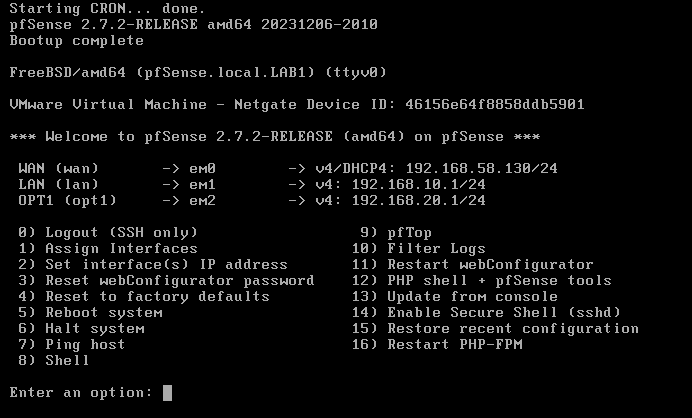
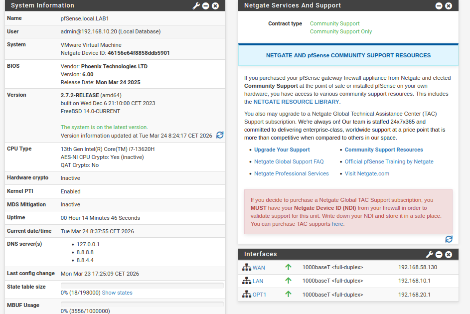

# Configuration pfSense

## 1. Objectif
Configurer pfSense comme pare-feu et routeur pour le LAB avec segmentation et contrôle du trafic :
- Le routage entre les VLANs et Internet.
- La fonction de serveur DHCP pour les VLANs.
- Le transfert DNS (DNS Forwarding).
- Les règles de pare-feu pour contrôler les flux de trafic dans le réseau.

## 2. Configuration réseau

| Interface | Rôle | IP / Mode |
| --------- | ----------------------- | ---------------- |
| em0 | WAN | DHCP (VMware NAT) |
| em1 | LAN (VLAN 10 - serveurs) | 192.168.10.1/24 |
| em2 | OPT1 (VLAN 20 - clients)| 192.168.20.1/24 |

> **Note :** Sous VMware, il est souvent plus simple d'allouer une carte réseau virtuelle dédiée par VLAN pour cloisonner proprement les flux, bien que l'utilisation de sous-interfaces (Trunk 802.1Q) soit également possible.

#### Sur la console pfSense :
* **Option 1 - Assigner les interfaces :**
  * WAN = `em0`
  * LAN (VLAN 10) = `em1`
  * OPT1 (VLAN 20) = `em2`
* **Option 2 - Assigner les IP :**
  * `em1` = `192.168.10.1/24` (Pas de serveur DHCP activé sur cette interface, car les serveurs ont besoin d'adresses IP fixes).
  * `em2` = `192.168.20.1/24` (Avec serveur DHCP activé pour les clients).



## 3. Web GUI pfSense & Configuration du serveur Ubuntu
### Configuration IP de la VM Ubuntu :
* Adresse IP = `192.168.10.20/24` (Statique)
* Passerelle (Gateway) = `192.168.10.1`
* DNS = `192.168.10.1`
* *Résultat :* Ping vers pfSense ➜ ✅

Depuis un navigateur web, accès à l'interface d'administration : `http://192.168.10.1`
* **Configuration Wizard :**
  * Hostname = `pfsense`
  * Domain = `local.LAB1`
  * Primary DNS = `8.8.8.8`
  * Secondary DNS = `8.8.4.4`
  * NTP Server = `2.pfsense.pool.ntp.org`
  * Time Zone = `Europe/Paris`



## 4. Résolution d'un problème DNS sous Ubuntu
**Problème rencontré :** 
* `ping 8.8.8.8` = ✅ (La connectivité IP fonctionne)
* `ping google.com` = ❌ (La résolution de nom échoue)

**Cause :** 
Le service `systemd-resolved` d'Ubuntu utilise par défaut un résolveur DNS local de boucle (`127.0.0.53`) au lieu d'interroger directement la passerelle pfSense (`192.168.10.1`).

**Solution appliquée :**
```bash
sudo systemctl disable systemd-resolved
sudo systemctl stop systemd-resolved 
sudo rm /etc/resolv.conf
echo "nameserver 192.168.10.1" | sudo tee /etc/resolv.conf

(Alternative : Modifier le fichier /etc/systemd/resolved.conf en décommentant la ligne DNS= et en y renseignant 192.168.10.1).